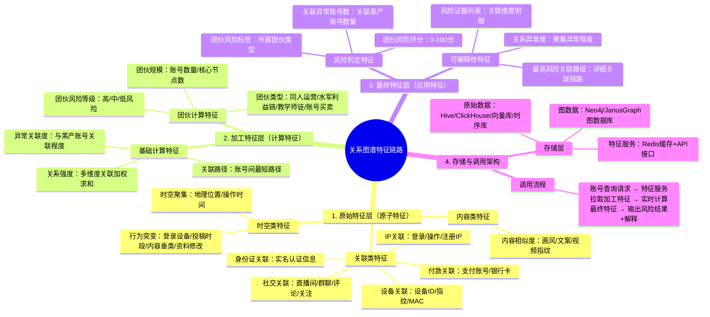

# 生态账号Agent 关系图谱特征链路（脑图版）

---
## 脑图说明
### 🔹 第一层：原始特征层
- 所有数据均来自业务系统原始采集，未经过加工
- 分类存储在不同数据库，敏感数据加密脱敏，符合合规要求
- 是整个关系图谱的基础节点和边数据来源
### 🔹 第二层：加工特征层
- 通过图算法（Louvain聚类、最短路径、标签传播等）+规则引擎计算生成
- 所有加工结果存储在图数据库中，作为节点和边的属性
- 团伙类型识别准确率≥95%，可覆盖90%以上的已知团伙模式
### 🔹 第三层：最终特征层
- 直接输入风险模型的特征，无需额外计算
- 包含可解释性特征，可直接输出给用户说明风险原因
- 支持实时查询，响应时间≤200ms
### 🔹 存储与调用架构
- 读写分离：原始数据批量写入，加工特征实时查询
- 多层缓存：热点特征缓存到Redis，提升查询效率
- 可扩展性：支持新增特征维度和团伙类型，无需重构架构
---
## 风险输出示例
> 🚨 **账号风险判定：高风险（92分）**
> 
> 📋 **风险解释：**
> 1. 该账号属于【水军利益链】团伙，团伙规模共127个账号
> 2. 关联路径：当前账号 → 共用设备 → 账号B → 共用付款账号 → 已知黑产账号C（3度关联）
> 3. 异常行为：7天内更换5台设备登录，投稿时段从白天变为凌晨，内容相似度与团伙其他账号达92%
> 
> 🔍 **关联证据：**
> • 设备关联：与23个异常账号共用设备ID:XXX
> • IP关联：与47个异常账号共用IP段:XXX.XXX.XXX.0/24
> • 内容关联：与团伙账号文案重合度达87%
